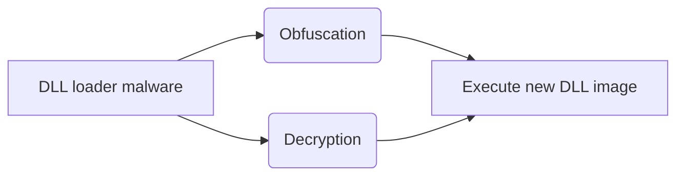

DLL Loader Unpacker
===============================================

Introduction
---------------------
DLL Loader Unpacker is a Windows malware reversing tool to unpack the DLL loader malware described below.



 Getting Started
---------------------

Compile DllInjector.exe & DllLoaderUnpacker.dll by Visual Studio 2017 with configuration Debug | x86.

Run the following command on Windows XP. (Windows 7 support is WIP)

```
DllInjector.exe -d DllLoaderUnpacker.dll -e 2017-02-06-Terdot.A-Zloader-from-Hancitor-malspam.exe 
```

If everything works as intended, you should see unpacked malware image (e.g. Dump32-0.dll) dropped very soon.

Design & Implementation
---------------------
The tool utilizes Detour to hook ZwAllocateVirtualMemory and ZwProtectVirtualMemory NTAPIs. When malware requests memory with executable permission, hook engine changes memory permission to be non-executable.

```c
ZwAllocateVirtualMemory(..., PAGE_EXECUTE_READWRITE, ...) ----> ZwAllocateVirtualMemory(..., PAGE_READONLY, ...)
```

In order to maintain the page size, page starting address and page attributes, we develop a dedicated list data structure, Page List. Page List is built on a doubly linked list library utlist (https://troydhanson.github.io/uthash/utlist.html).

Each element node in a Page List is an interval. The data structure is built so that it can combine the nearby intervals with the same property. This allows for efficient memory address searching.

Each time a VEH exception occurs, the faulty memory address will be recorded. The exception handler of ours will then search the address in the Page List in order to get the original page properties (as the malware intended). If there is a match, the dumping routine will be triggered and the page property will be restored, which it allows the malware to continue execution and more malware binary modules to be dumped (if any).

Test
---------------------
In Windows XP x86 SP3 (1G, 2 cores), we test our tool with 17 DLL loader malware including some well-known APT (e.g. Vawtrak).

| ID |Malware MD5 | Malware File Name catched by Sandbox | Malware Family | Result |
|----------------|-------------------------------|-----------------------------|-----------------------------|-----------------------------|
| 1 | f0586879d9a3ec0ce2e1ee66c8fd1929 | 2017-08-21-Trickbot-Xttayo.exe | TrickBot | Success (dll component)   |
| 2 | 75ef8061a7dda4c4de85dc6e768b64ca | elektrik.exe | Zbot | Success (dll component) |
| 3 | eeef5204913a313f64a2e06dea22b936 | 1842-5-f2eb_convincingly.exe | Unknown | Fail (malware crashed) |
| 4 | c391cef3f76c741a41e74d4f0636b7a8 | 19065304.exe | Emotet | Success (exe component) |
| 5 | a30290a2c445b6d4e8f3edc20ff5e7ec | 2017-02-06-Terdot.A-Zloader-from-Hancitor-malspam.exe | Zbot | Success (dll component) |
| 6 | a7d7ff3a3b7db26af32202754674735e | 2017-09-08-Locky-binary-AppData-Roaming-2428.exe | Locky Ransomware | Success (dll component) |
| 7 | 75f0638e40cb937d9a553eb08b57d54c | 2017-09-08-Locky-binary-AppData-Roaming-createCoQURs.exe | Locky Ransomware | Success (dll component)
| 8 | 07e2d017f21f2d27b5854fc93345511e | AWB19219291pdf.exe | Unknown | Success (dll component with TLS callback detected) |
| 9 | 88d93ae49ac5b3d0750052eb4acdaca3 | NDHhsgdet3.exe | Dridex | Success (dll component) |
| 10 | eee983c77fc24465ab7ea4f4dccf7a91 | P.O__.exe | LokiBot | Success (dll component) | 
| 11 | 3da144d292eeec6ee7f844f79dbdea1c | frat.exe | Zbot | Success (dll component) |
| 12 | 6c7d941f5b516ceb3d920b92f8d00c53 | nq.exe | Neverquest (Vawtrak) | Success (dll component) |
| 13 | 0e970bf58f190e4b9fd3b0796f0b6443 | panda0525.exe | Yakes | Success (dll component) |
| 14 | 2a038a8baa839fa1f67cc6ec28fbabaa | panda0526.exe | Locky Ransomware | Success (dll component) |
| 15 | 735bf606af6385e7d838e1bb553dc79d | serverlaunch.exe | Emotet | Success (dll component) |
| 16 | 132b80aeac08f60b82543d8d566b01ee | upd5f17aee2.exe | Panda Banker | Success (dll component) |
| 17 | a3aff338c99e73e53e2efd9840254cfc | upda92f6c2c.exe | Yake | Success (dll component) | 

E.g. Unpacked dll info for Vawtrak:
https://www.virustotal.com/#/file/0e34064a9e44c097392b8f58361821801fbc73ae45decbdf80a087359c25fd6e/detection
